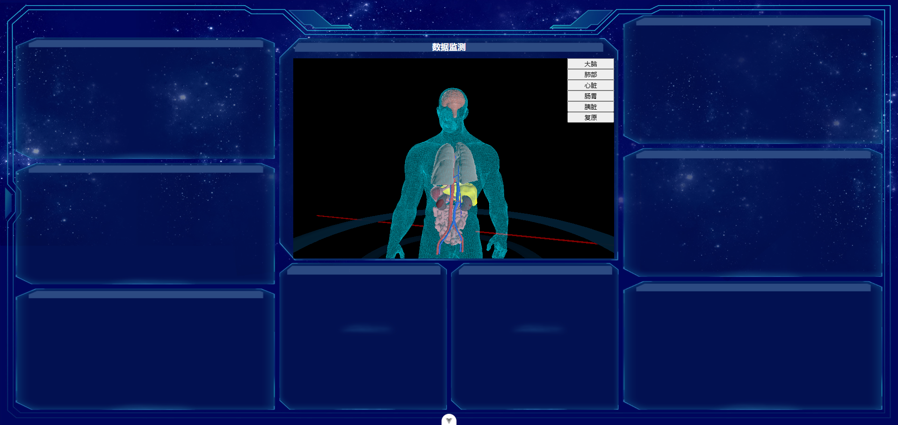
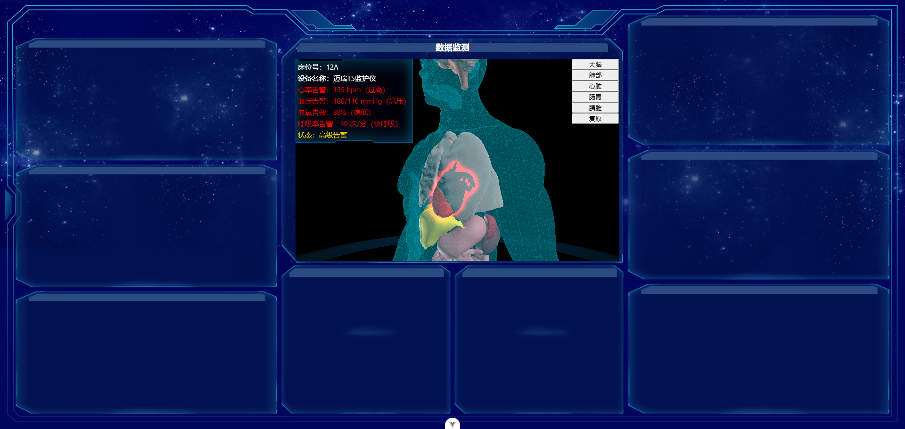

# three-body
threejs基础场景效果

包含
- 基础场景
- tween动画
- 后期处理outlinePass
- 环境光+平行光
- glb模型加载
- 模型部位交互

## 效果图


```sh
npm install
```
### Compile and Hot-Reload for Development

```sh
npm run dev
```

### Type-Check, Compile and Minify for Production

```sh
npm run build
```
